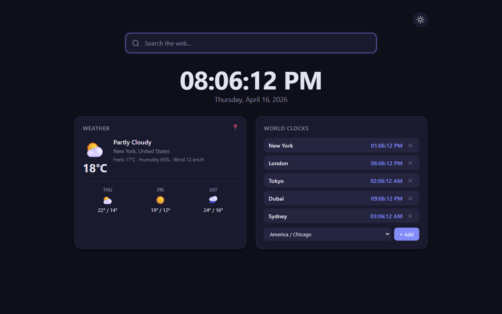
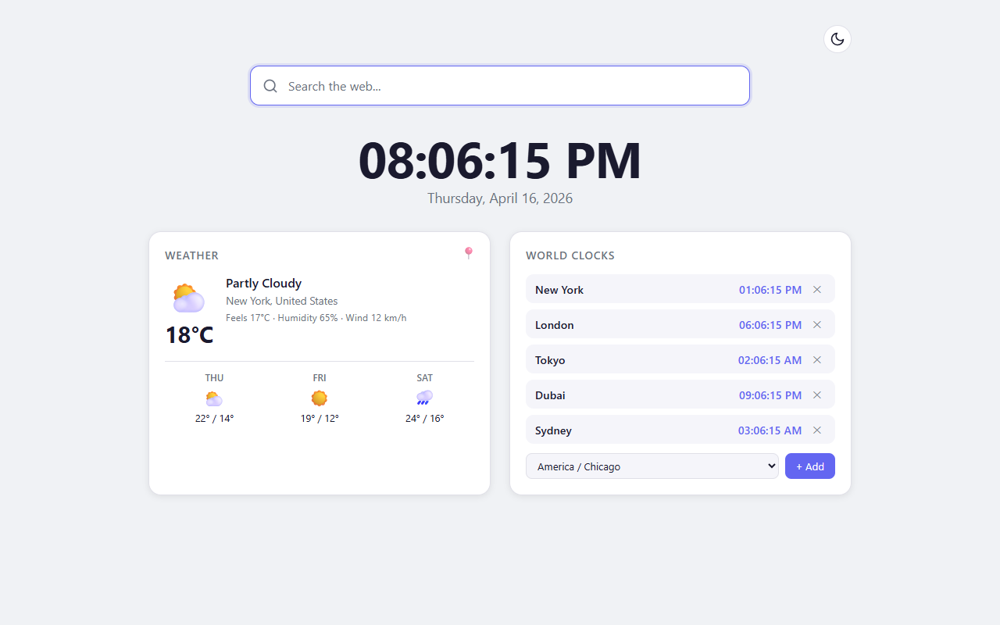
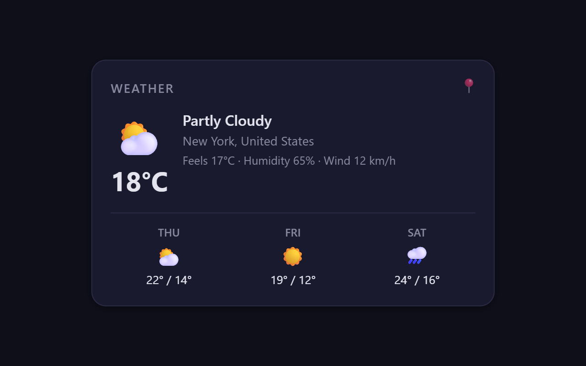
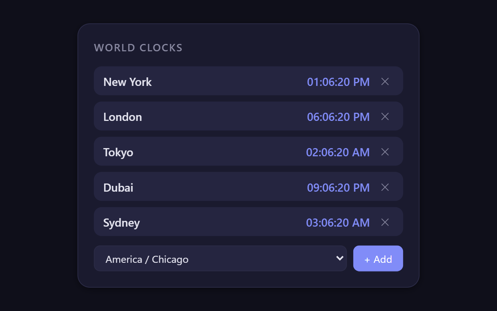

# Weather & Clock Dashboard — Firefox New Tab Extension

> Replace your Firefox new tab with a live weather dashboard, world clocks, and search.

[](https://addons.mozilla.org/en-US/firefox/addon/weather-clock-dashboard/)
[](LICENSE)
[](https://github.com/oren-sys/weather-clock-dashboard/stargazers)

**[⬇ Install on Firefox — Free →](https://addons.mozilla.org/en-US/firefox/addon/weather-clock-dashboard/)**

---

## Screenshots

| Dark Mode | Light Mode |
|-----------|------------|
|  |  |

| Weather Detail | World Clocks |
|----------------|--------------|
|  |  |

---

## What It Does

Weather & Clock Dashboard replaces the default Firefox new tab page with a clean, information-rich dashboard:

- **Live Weather** — Current conditions and 3-day forecast via [Open-Meteo](https://open-meteo.com). Set any city worldwide. No API key needed.
- **World Clocks** — Track time across multiple time zones simultaneously. Add, remove, and reorder your clock list.
- **Search Bar** — Prominent search bar that uses your default Firefox search engine.
- **Dark \& Light Mode** — One-click theme toggle. Your preference is remembered.
- **Fast \& Lightweight** — Pure HTML/CSS/JS, zero frameworks. Loads instantly on every new tab.
- **Privacy-Friendly** — No personal data collected. No tracking cookies. Your city is stored only on your device.

---

## Install

### From Firefox Add-ons (Recommended)

1. Visit the [Firefox Add-ons page](https://addons.mozilla.org/en-US/firefox/addon/weather-clock-dashboard/)
2. Click **Add to Firefox**
3. Open a new tab — your dashboard is live

### Development Install

1. Clone this repository
2. Open Firefox → `about:debugging#/runtime/this-firefox`
3. Click **Load Temporary Add-on...**
4. Select `manifest.json` from the root folder
5. Open a new tab

---

## Usage

| Feature | How to Use |
|---------|-----------|
| Set weather city | Click the pin icon on the weather widget |
| Add a world clock | Use the time zone dropdown |
| Remove a world clock | Click the X on any clock |
| Toggle dark/light mode | Click the sun/moon icon (top right) |

All preferences are saved locally via `browser.storage.local` and persist across sessions.

---

## Privacy

- **No personal data collected.** Your city name and time zone preferences stay on your device.
- **No tracking cookies.**
- **Open source** — read every line at https://github.com/oren-sys/weather-clock-dashboard
- **Only external request:** weather data from [Open-Meteo](https://open-meteo.com) — a free, open-source weather API with no API key required.

See [PRIVACY_POLICY.md](PRIVACY_POLICY.md) for the full policy.

---

## Project Structure

```
weather-clock-dashboard/
├── manifest.json      # WebExtension manifest (v2)
├── dashboard.html     # New tab page HTML
├── dashboard.js       # All logic: clock, weather, search, world clocks, theme
├── styles.css         # Dark/light themed styles
├── analytics.js       # Privacy-friendly anonymous analytics
├── icons/
├── store-assets/screenshots/  # Product screenshots
└── README.md
```

No build step required. Vanilla JavaScript and CSS — loads instantly.

---

## Technical Notes

- **Manifest V2** for Firefox compatibility
- **No remote code loading** — all assets bundled locally (Mozilla policy compliant)
- **Permissions:** `storage` (save preferences), access to weather API only

---

## Contributing

Feedback and pull requests welcome. Open an issue to suggest features or report bugs.

---

## License

MIT — see [LICENSE](LICENSE) for details.

---

**[⬇ Install Weather \& Clock Dashboard on Firefox →](https://addons.mozilla.org/en-US/firefox/addon/weather-clock-dashboard/)**
